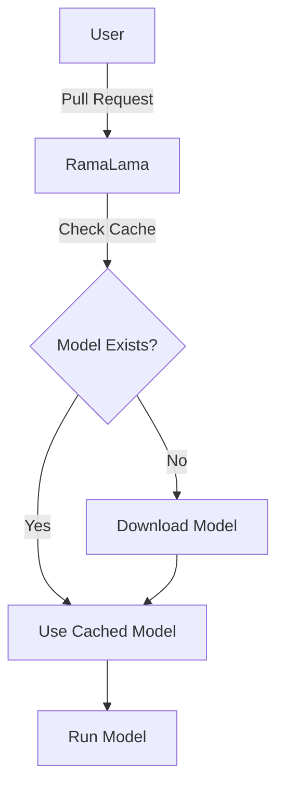

# RamaLama Documentation Formatting Standards

**Version:** 1.0  
**Status:** Proposed  
**Author:** Ibrahim Olawoyin (@Olawoyin365)  
**Date:** April 2, 2026  
**Purpose:** Establish consistent, high-quality documentation standards for the RamaLama project

---

## Table of Contents

1. [Introduction](#introduction)
2. [Core Principles](#core-principles)
3. [Document Structure](#document-structure)
4. [Docusaurus Frontmatter](#docusaurus-frontmatter)
5. [Heading Hierarchy](#heading-hierarchy)
6. [Text Formatting](#text-formatting)
7. [Code Examples](#code-examples)
8. [Tables](#tables)
9. [Lists](#lists)
10. [Links and References](#links-and-references)
11. [Images and Diagrams](#images-and-diagrams)
12. [Admonitions and Callouts](#admonitions-and-callouts)
13. [Command Documentation](#command-documentation)
14. [Configuration Documentation](#configuration-documentation)
15. [Examples and Tutorials](#examples-and-tutorials)
16. [File Naming Conventions](#file-naming-conventions)
17. [Language and Tone](#language-and-tone)
18. [Accessibility](#accessibility)
19. [Quality Checklist](#quality-checklist)
20. [Contributing to This Standard](#contributing-to-this-standard)

---

## Introduction

### Purpose

This document establishes formatting and style standards for RamaLama documentation to ensure consistency, readability, and maintainability across all documentation pages. It synthesizes best practices from:

- **Docusaurus Documentation Guidelines:** https://docusaurus.io/docs/styling-layout/
- **Fedora Documentation Style Guide:** https://docs.fedoraproject.org/en-US/fedora-docs/contributing-docs/style-guide/
- **Industry Best Practices:** Technical writing standards for developer documentation

### Scope

These standards apply to:
- All Markdown files in the `docs/` directory
- README files
- Man pages converted to Markdown
- Tutorials and guides
- API documentation
- Configuration references

### Goals

1. **Consistency:** All documentation pages follow the same formatting patterns
2. **Readability:** Content is easy to scan, understand, and navigate
3. **Maintainability:** Documentation is straightforward to update and extend
4. **Accessibility:** Content is accessible to users with different abilities and tools
5. **Professionalism:** Documentation reflects the quality and maturity of the RamaLama project

---

## Core Principles

### 1. User-First Approach

Write for the reader, not for yourself. Every page should answer:
- What is this?
- Why should I care?
- How do I use it?
- Where can I learn more?

### 2. Progressive Disclosure

Start simple, add complexity progressively:
- Overview first, details later
- Common use cases before advanced topics
- Examples before technical specifications

### 3. Show, Don't Just Tell

- Include working examples for every feature
- Provide copy-paste commands when possible
- Show expected output
- Demonstrate real-world scenarios

### 4. Consistency Over Cleverness

Follow established patterns even if you think a different approach might be "better" for one specific case. Consistency aids comprehension.

### 5. Accuracy Above All

- Test every command before documenting it
- Verify every configuration option
- Update documentation when behavior changes
- Flag deprecated features clearly

---

## Document Structure

### Standard Page Layout

Every documentation page should follow this structure:

```markdown
---
[Frontmatter]
---

# Page Title

## Overview
Brief introduction (2-4 sentences)

## Prerequisites (if applicable)
What users need before proceeding

## Main Content
Primary documentation content organized into logical sections

## Examples (if applicable)
Practical, working examples

## Troubleshooting (if applicable)
Common issues and solutions

## See Also
Related documentation pages
```

### Section Ordering

**For Command Documentation:**
1. Overview
2. Syntax
3. Options/Flags
4. Examples
5. Exit Codes (if applicable)
6. Troubleshooting
7. See Also

**For Configuration Documentation:**
1. Overview
2. File Locations
3. Environment Variables
4. Configuration Format
5. Configuration Reference (alphabetically organized)
6. Complete Example
7. See Also

**For Tutorial Documentation:**
1. Overview
2. Prerequisites
3. Step-by-step Instructions
4. Verification
5. Next Steps
6. Troubleshooting
7. See Also

---

## Docusaurus Frontmatter

### Required Fields

Every documentation page **must** include frontmatter at the top:

```yaml
---
title: Page Title
sidebar_label: Short Label
description: Brief description for SEO and search results
keywords: [keyword1, keyword2, keyword3]
---
```

### Field Specifications

#### title
**Type:** String  
**Required:** Yes  
**Purpose:** Displayed as the page heading and browser tab title

**Guidelines:**
- Use title case (capitalize major words)
- Be descriptive but concise
- Maximum 60 characters for SEO

**Examples:**
```yaml
✓ title: Configuration File
✓ title: Running AI Models
✗ title: ramalama.conf  # Too technical, not descriptive
✗ title: How to Configure RamaLama and Set Up Everything  # Too long
```

#### sidebar_label
**Type:** String  
**Required:** Yes  
**Purpose:** Displayed in the documentation sidebar navigation

**Guidelines:**
- Short and scannable
- Maximum 30 characters
- Use abbreviated forms when necessary

**Examples:**
```yaml
✓ sidebar_label: ramalama.conf
✓ sidebar_label: Quick Start
✓ sidebar_label: GPU Support
✗ sidebar_label: Configuration File Documentation  # Too long
```

#### description
**Type:** String  
**Required:** Yes  
**Purpose:** Search engine description and internal search results

**Guidelines:**
- Complete sentence or phrase
- Maximum 160 characters
- Include key terms users might search for

**Examples:**
```yaml
✓ description: Configuration file documentation for RamaLama AI tool
✓ description: Learn how to run AI models locally using RamaLama
✗ description: This page documents the configuration.  # Too vague
```

#### keywords
**Type:** Array  
**Required:** Yes  
**Purpose:** Improve internal search and discoverability

**Guidelines:**
- 3-8 relevant keywords
- Include variations (ramalama, config, configuration)
- Use lowercase except for proper nouns

**Examples:**
```yaml
✓ keywords: [ramalama, configuration, config, ramalama.conf, TOML]
✓ keywords: [gpu, cuda, nvidia, acceleration, hardware]
✗ keywords: [stuff, things, ramalama]  # Not descriptive
```

### Optional Fields

#### slug
Use to customize the URL path:
```yaml
slug: /custom-url-path
```

#### tags
For blog posts or categorized content:
```yaml
tags: [tutorial, beginner, installation]
```

### Complete Frontmatter Examples

**Command Documentation:**
```yaml
---
title: ramalama run
sidebar_label: run
description: Run AI models as a chatbot using RamaLama
keywords: [ramalama, run, chatbot, ai, models]
---
```

**Configuration Documentation:**
```yaml
---
title: Configuration File
sidebar_label: ramalama.conf
description: Configuration file documentation for RamaLama AI tool
keywords: [ramalama, configuration, config, ramalama.conf, TOML]
---
```

**Tutorial Documentation:**
```yaml
---
title: Getting Started with RamaLama
sidebar_label: Quick Start
description: Step-by-step guide to installing and running your first AI model
keywords: [ramalama, tutorial, quickstart, installation, beginner]
---
```

---

## Heading Hierarchy

### Rules

1. **One H1 per page:** The page title (automatically generated from frontmatter or explicit `#`)
2. **Logical nesting:** Never skip levels (H1 → H2 → H3, not H1 → H3)
3. **Consistent capitalization:** Use sentence case for headings
4. **Descriptive headings:** Make headings scannable and meaningful

### Heading Levels

```markdown
# H1: Page Title (only one per page)

## H2: Major Section

### H3: Subsection

#### H4: Sub-subsection (use sparingly)

##### H5: Avoid if possible

###### H6: Never use
```

### Capitalization

**Use sentence case:**
```markdown
✓ ## Installing RamaLama
✓ ### On macOS
✓ ### On Fedora Linux

✗ ## Installing Ramalama  # Inconsistent capitalization
✗ ### on macOS  # Should capitalize first word
✗ ## INSTALLING RAMALAMA  # All caps inappropriate
```

### Heading Examples

**Good Hierarchy:**
```markdown
# Configuration File

## Overview

## File Locations

### Global Configuration Files

### User Configuration Files

## Configuration Format

### TOML Syntax

### Configuration Tables

## Configuration Reference

### ramalama Table

#### backend

#### engine

#### store
```

**Bad Hierarchy:**
```markdown
# Configuration File

### Overview  # Skipped H2

## File Locations

#### Global Files  # Skipped H3

## Format

# TOML  # Multiple H1s
```

### Heading Content Guidelines

**Be descriptive:**
```markdown
✓ ## Installing on Fedora Linux
✗ ## Fedora

✓ ## Troubleshooting GPU Detection
✗ ## Problems

✓ ## Environment Variables
✗ ## Variables
```

**Avoid questions in headings:**
```markdown
✓ ## Common Installation Issues
✗ ## How Do I Install?

✓ ## GPU Requirements
✗ ## What GPU Do I Need?
```

**Keep headings concise:**
```markdown
✓ ## Configuration Options
✗ ## All the Different Configuration Options You Can Use

✓ ## Quick Start
✗ ## Quick Start Guide for Beginners to Get Started Quickly
```

---

## Text Formatting

### Emphasis

**Bold:** Use for UI elements, important terms on first mention, and strong emphasis
```markdown
Click the **Save** button.
The **backend** option specifies which GPU to use.
**Important:** Back up your data first.
```

**Italic:** Use sparingly for subtle emphasis or technical terms
```markdown
The model is *quantized* to reduce file size.
This option is *deprecated* and will be removed.
```

**Code/Monospace:** Use for file paths, commands, configuration keys, and code elements
```markdown
Edit the `ramalama.conf` file.
Set `backend="cuda"` in your configuration.
The models are stored in `~/.local/share/ramalama`.
```

### Lists vs. Paragraphs

**Use paragraphs when:**
- Explaining concepts
- Providing context
- Describing relationships between ideas

**Use lists when:**
- Enumerating steps
- Listing options or features
- Providing multiple examples
- Showing prerequisites

**Example:**

**Good (paragraph for explanation):**
```markdown
RamaLama automatically detects your system's GPU capabilities and selects 
the appropriate backend. On systems with NVIDIA GPUs, it uses CUDA for 
optimal performance. AMD systems default to ROCm or Vulkan depending on 
the platform.
```

**Good (list for options):**
```markdown
RamaLama supports the following backends:
- `cuda`: NVIDIA GPUs
- `rocm`: AMD GPUs
- `vulkan`: Cross-platform support
- `auto`: Automatic detection
```

### Inline Code

Use backticks for:
- File paths: `` `~/.config/ramalama/ramalama.conf` ``
- Commands: `` `ramalama run` ``
- Configuration keys: `` `backend` ``
- Environment variables: `` `RAMALAMA_BACKEND` ``
- Code elements: `` `true` ``, `` `false` ``
- Version numbers: `` `0.18.0` ``

**Examples:**
```markdown
✓ Set the `log_level` option to `debug`.
✓ Run `ramalama info` to view configuration.
✓ Models are stored in `$HOME/.local/share/ramalama`.

✗ Set the log_level option to debug.  # Missing backticks
✗ Run ramalama info to view configuration.  # Missing backticks
```

### Capitalization

**Product names:**
- RamaLama (capital R, capital L)
- Podman (capital P)
- Docker (capital D)

**File and directory names:**
- `ramalama.conf` (lowercase)
- `ramalama` (the command)

**Configuration keys:**
- `backend` (lowercase, in code)
- `RAMALAMA_BACKEND` (uppercase for env vars)

---

## Code Examples

### Code Block Syntax

Always specify the language for syntax highlighting:

````markdown
```bash
ramalama run tiny
```

```toml
[ramalama]
backend = "cuda"
```

```python
import ramalama
model = ramalama.load("tiny")
```

```yaml
services:
  ramalama:
    image: quay.io/ramalama/ramalama
```
````

### Supported Languages

Common languages for RamaLama documentation:
- `bash`: Shell commands
- `toml`: Configuration files
- `python`: Python code
- `yaml`: YAML configuration
- `json`: JSON data
- `dockerfile`: Dockerfiles
- `text`: Plain text output

### Command Examples

**Single command:**
```bash
ramalama pull tiny
```

**Multiple commands (show separately):**
```bash
ramalama pull tiny
```

```bash
ramalama run tiny
```

**Command with output:**
```bash
ramalama version
```

**Output:**
```
ramalama version 0.18.0
```

**Long command (use line continuation):**
```bash
ramalama run \
  --backend cuda \
  --port 8080 \
  ollama://granite3-moe
```

### Configuration Examples

**Complete example:**
```toml
[ramalama]
backend = "cuda"
engine = "podman"
store = "$HOME/.local/share/ramalama"
log_level = "info"
```

**Partial example (show only relevant section):**
```toml
[ramalama]
backend = "cuda"
```

### Placeholder Conventions

Use uppercase for placeholders:
```bash
ramalama run MODEL_NAME
ramalama push oci://REGISTRY/REPOSITORY:TAG
export RAMALAMA_BACKEND=BACKEND_TYPE
```

Or use angle brackets:
```bash
ramalama run <model-name>
ramalama push oci://<registry>/<repository>:<tag>
```

### Comments in Code

Use comments sparingly to explain non-obvious parts:
```bash
# Download the model
ramalama pull tiny

# Start serving with GPU acceleration
ramalama serve --backend cuda tiny
```

```toml
[ramalama]
# Use CUDA for NVIDIA GPUs
backend = "cuda"

# Store models in custom location
store = "/data/models"
```

### Code Block Titles

For complex examples, add a title:

````markdown
**File: `~/.config/ramalama/ramalama.conf`**
```toml
[ramalama]
backend = "cuda"
engine = "podman"
```
````

### Copy-Paste Ready

Ensure all commands are:
- Complete (not truncated)
- Tested (actually work)
- Safe (no destructive operations without warning)

**Good (copy-paste ready):**
```bash
ramalama pull ollama://tinyllama
ramalama run ollama://tinyllama
```

**Bad (incomplete):**
```bash
ramalama pull [model]
ramalama run [same model]
```

---

## Tables

### When to Use Tables

Use tables for:
- Comparing options
- Listing parameters with descriptions
- Showing configuration values
- Displaying structured data

**Do not use tables for:**
- Single columns of data (use lists)
- Long paragraphs of text
- Content that wraps badly

### Table Syntax

**Standard table:**
```markdown
| Column 1 | Column 2 | Column 3 |
|----------|----------|----------|
| Value 1  | Value 2  | Value 3  |
| Value 4  | Value 5  | Value 6  |
```

**With alignment:**
```markdown
| Left-aligned | Center-aligned | Right-aligned |
|:-------------|:--------------:|--------------:|
| Text         | Text           | 123           |
| More text    | More text      | 456           |
```

### Table Guidelines

**Headers:**
- Always include a header row
- Use descriptive header names
- Capitalize first letter of each word

**Content:**
- Keep cells concise
- Use inline code for technical terms
- Avoid line breaks within cells
- Use consistent capitalization

**Formatting:**
- Align pipes for readability in source
- Leave one space after opening pipe
- Leave one space before closing pipe

### Table Examples

**Good (configuration options):**
```markdown
| Option | Type | Default | Description |
|--------|------|---------|-------------|
| `backend` | string | `"auto"` | GPU backend to use |
| `engine` | string | `"podman"` | Container engine |
| `store` | string | `"~/.local/share/ramalama"` | Model storage path |
```

**Good (file locations):**
```markdown
| Path | Platform | Priority |
|------|----------|----------|
| `/usr/share/ramalama/ramalama.conf` | Linux | 1 (lowest) |
| `/etc/ramalama/ramalama.conf` | Linux | 2 |
| `~/.config/ramalama/ramalama.conf` | All | 3 (highest) |
```

**Good (command options):**
```markdown
| Flag | Short | Description |
|------|-------|-------------|
| `--backend` | `-b` | Specify GPU backend |
| `--port` | `-p` | Set server port |
| `--debug` | `-d` | Enable debug logging |
```

**Bad (too much text in cells):**
```markdown
| Option | Description |
|--------|-------------|
| backend | This option allows you to specify which GPU backend you want to use for running your AI models. You can choose from CUDA, ROCm, Vulkan, and others depending on your hardware. |
```

**Better (concise cells):**
```markdown
| Option | Description |
|--------|-------------|
| `backend` | GPU backend for model inference. See [Backend Options](#backend-options) for details. |
```

### Complex Tables

For complex data, consider alternatives:
- Multiple simpler tables
- Definition lists
- Nested sections with examples

**Instead of a complex table:**
```markdown
| Backend | AMD GPU | NVIDIA GPU | Intel GPU | CPU | Windows | Linux | macOS |
|---------|---------|------------|-----------|-----|---------|-------|-------|
| cuda    | No      | Yes        | No        | No  | Yes     | Yes   | Yes   |
| rocm    | Yes     | No         | No        | No  | Yes     | Yes   | No    |
```

**Use structured sections:**
```markdown
### CUDA Backend

**Compatible Hardware:**
- NVIDIA GPUs only

**Platform Support:**
- Windows: Yes
- Linux: Yes
- macOS: Yes

### ROCm Backend

**Compatible Hardware:**
- AMD GPUs only

**Platform Support:**
- Windows: Yes
- Linux: Yes
- macOS: No
```

---

## Lists

### Unordered Lists

Use for items without sequence or priority:

```markdown
RamaLama supports the following transports:
- Ollama
- HuggingFace
- OCI registries
- ModelScope
```

### Ordered Lists

Use for sequential steps or ranked items:

```markdown
To install RamaLama:
1. Install Python 3.10 or later
2. Run `pip install ramalama`
3. Verify installation with `ramalama version`
```

### Nested Lists

Indent nested items with 2 spaces:

```markdown
RamaLama installation methods:
- Package managers
  - DNF (Fedora)
  - Homebrew (macOS)
- Python package
  - PyPI
  - pipx
- Self-contained installers
  - macOS .pkg installer
  - Windows installer
```

### List Formatting Rules

**Capitalization:**
```markdown
✓ - Install RamaLama
✓ - Run the command
✗ - install RamaLama  # Should capitalize first word
✗ - Run The Command  # Capitalize only first word
```

**Punctuation:**
```markdown
✓ Items are short phrases (no periods)
✓ Full sentences get periods.
✗ Items are short phrases.  # No period needed
✗ Full sentences without periods  # Should have period
```

**Parallelism:**
```markdown
✓ Good:
- Install dependencies
- Configure settings
- Run the application

✗ Bad:
- Install dependencies
- Configuration of settings
- Running the application
```

**Blank lines:**
```markdown
✓ No blank lines between items in same list

✗ Avoid:
- Item 1

- Item 2
```

### Task Lists

For checklists, use task list syntax:

```markdown
Installation checklist:
- [x] Python installed
- [x] Podman installed
- [ ] GPU drivers configured
- [ ] First model downloaded
```

---

## Links and References

### Internal Links

**Link to other documentation pages:**
```markdown
See [Configuration File](../configuration/conf.md) for details.
See the [Installation Guide](installation.md) for setup instructions.
```

**Link to sections within same page:**
```markdown
See [File Locations](#file-locations) above.
Refer to the [Examples](#examples) section below.
```

**Link to sections in other pages:**
```markdown
See [Backend Options](configuration.md#backend) in the configuration guide.
```

### External Links

**Use descriptive link text:**
```markdown
✓ See the [Docusaurus documentation](https://docusaurus.io) for more information.
✗ For more information, click [here](https://docusaurus.io).

✓ Download from the [GitHub releases page](https://github.com/containers/ramalama/releases).
✗ Download [here](https://github.com/containers/ramalama/releases).
```

**Open external links in new tabs (when appropriate):**

Docusaurus automatically handles this for external domains.

### Reference Links

For repeated URLs, use reference-style links:

```markdown
RamaLama supports multiple registries including [HuggingFace][hf], 
[Ollama][ollama], and [OCI registries][oci].

[hf]: https://huggingface.co
[ollama]: https://ollama.com
[oci]: https://opencontainers.org
```

### Command References

Link to man pages or command documentation:

```markdown
See [ramalama-run(1)](ramalama-run.1.md) for full command options.
Use [ramalama-serve(1)](ramalama-serve.1.md) to start a REST API server.
```

### Link Formatting

**Wrap URLs in angle brackets when showing full URL:**
```markdown
Report issues at <https://github.com/containers/ramalama/issues>
Visit <https://ramalama.ai> for more information
```

**Use inline code for file paths that aren't links:**
```markdown
Edit the `~/.config/ramalama/ramalama.conf` file.
Models are stored in `/usr/share/ramalama/models/`.
```

---

## Images and Diagrams

### Image Location

Store images in:
```
docs/assets/images/
```

Or for page-specific images:
```
docs/configuration/images/
```

### Image Syntax

**Standard image:**
```markdown

```

**With title/tooltip:**
```markdown

```

**Centered image with caption:**
```markdown
<p align="center">
  
  <br>
  <em>Figure 1: Description of the image</em>
</p>
```

### Alt Text Guidelines

Write descriptive alt text:

```markdown
✓ 
✓ 
✗ 
✗ 
```

### Image Size Recommendations

- Screenshots: PNG format, max 1200px wide
- Diagrams: SVG preferred, PNG acceptable
- Icons: SVG preferred, max 128px
- Photos: JPG format, max 800px wide

### Diagrams

**Prefer text-based diagrams when possible:**

```markdown
\`\`\`
+------------------+
|   User Request   |
+--------+---------+
         |
         v
+------------------+
|    RamaLama      |
+--------+---------+
         |
         v
+------------------+
|   Container      |
|   Engine         |
+--------+---------+
         |
         v
+------------------+
|   AI Model       |
+------------------+
\`\`\`
```

**For complex diagrams, use Mermaid:**

````markdown

````

### Accessibility

**Always include alt text:**
- Describe what's shown, not just "image" or "screenshot"
- Keep it concise but descriptive
- Include relevant text from the image

**Avoid images of text:**
- Use actual text instead
- If unavoidable, transcribe text in alt or caption

---

## Admonitions and Callouts

Docusaurus supports special callout blocks for important information.

### Types of Admonitions

**Note:** General information
```markdown
:::note
Configuration changes require restarting RamaLama.
:::
```

**Tip:** Helpful suggestions
```markdown
:::tip
Use `backend="auto"` to automatically detect your GPU.
:::
```

**Info:** Additional context
```markdown
:::info
RamaLama supports both Podman and Docker as container engines.
:::
```

**Warning:** Important cautions
```markdown
:::warning
Changing the `store` path will not move existing models.
:::
```

**Danger:** Critical warnings
```markdown
:::danger
Removing all models with `ramalama rm --all` is irreversible.
:::
```

### When to Use Admonitions

**Use sparingly:**
- Important information that needs to stand out
- Common mistakes to avoid
- Critical warnings about data loss or security

**Don't overuse:**
- Too many callouts reduce effectiveness
- Not every piece of information needs emphasis
- Reserve for truly important content

### Admonition Examples

**Good use:**
```markdown
:::warning Platform-Specific Behavior
On Windows WSL2, Vulkan is not supported. RamaLama will automatically 
use vendor-specific backends instead.
:::
```

**Good use:**
```markdown
:::tip Performance Optimization
For faster model loading, store models on an SSD rather than HDD.
:::
```

**Overuse (bad):**
```markdown
:::note
RamaLama is written in Python.
:::

:::note
You can use Podman.
:::

:::note
The default port is 8080.
:::
```

### Custom Titles

Add custom titles to admonitions:

```markdown
:::note Configuration Priority
User configuration files override global configuration files.
:::
```

```markdown
:::warning Data Loss Risk
Back up your models before changing the storage directory.
:::
```

---

## Command Documentation

### Standard Format for Commands

Each command page should follow this structure:

```markdown
---
title: ramalama-COMMAND
sidebar_label: COMMAND
description: Brief description of what the command does
keywords: [ramalama, command, relevant, keywords]
---

# ramalama COMMAND

## Synopsis

\`\`\`
ramalama COMMAND [OPTIONS] ARGUMENTS
\`\`\`

## Description

Brief description of the command purpose and behavior.

## Options

### --option-name

**Type:** string/boolean/integer  
**Default:** default_value  
**Short form:** -o

Description of what this option does.

**Example:**
\`\`\`bash
ramalama COMMAND --option-name value
\`\`\`

## Examples

### Example 1: Common use case

Description of scenario.

\`\`\`bash
ramalama COMMAND --option value
\`\`\`

**Output:**
\`\`\`
Expected output here
\`\`\`

## Exit Codes

| Code | Meaning |
|------|---------|
| 0    | Success |
| 1    | General error |

## See Also

- [ramalama(1)](ramalama.1.md)
- [related-command(1)](related-command.1.md)
```

### Option Documentation Pattern

**Structure:**
```markdown
### --backend

**Type:** string  
**Default:** `"auto"`  
**Short form:** `-b`

Specifies the GPU backend to use for inference.

**Valid values:**
- `auto`: Automatic detection
- `cuda`: NVIDIA GPUs
- `rocm`: AMD GPUs
- `vulkan`: Cross-platform

**Example:**
\`\`\`bash
ramalama run --backend cuda tiny
\`\`\`
```

### Boolean Flags

```markdown
### --debug

**Type:** boolean  
**Default:** `false`  
**Short form:** `-d`

Enable debug logging output.

**Example:**
\`\`\`bash
ramalama run --debug tiny
\`\`\`
```

### Required vs Optional

Indicate required arguments clearly:

```markdown
## Synopsis

\`\`\`
ramalama pull [OPTIONS] MODEL
\`\`\`

**Arguments:**
- `MODEL` (required): Model identifier to pull
```

---

## Configuration Documentation

### Configuration Option Pattern

Each configuration option should be documented consistently:

```markdown
#### option_name

**Type:** type (string, integer, boolean, array)  
**Default:** `default_value`  
**Environment Override:** `ENV_VARIABLE_NAME` (if applicable)

Description of what this option does and when to use it.

**Valid values:** (if applicable)
- `value1`: Description
- `value2`: Description

**Platform-specific notes:** (if applicable)
Any platform-specific behavior or limitations.

**Example:**
\`\`\`toml
[table]
option_name = "value"
\`\`\`
```

### Complete Example

```markdown
#### backend

**Type:** string  
**Default:** `"auto"`  
**Environment Override:** `RAMALAMA_BACKEND`

Specifies the GPU backend to use for inference. This setting affects 
which container image is selected and how GPU resources are utilized.

**Valid values:**
- `auto`: Automatically detect GPU and select backend
- `cuda`: NVIDIA CUDA (NVIDIA GPUs only)
- `rocm`: AMD ROCm (AMD GPUs only)
- `vulkan`: Vulkan API (cross-platform)

**Platform-specific notes:**
On Windows WSL2, Vulkan is not supported. When using `backend="auto"`, 
vendor-specific backends are automatically preferred.

**Example:**
\`\`\`toml
[ramalama]
backend = "cuda"
\`\`\`
```

### Configuration Tables

Group related options under table headings:

```markdown
### ramalama Table

The `ramalama` table contains core configuration options.

#### backend
[Documentation as above]

#### engine
[Documentation as above]
```

---

## Examples and Tutorials

### Tutorial Structure

```markdown
# Tutorial Title

## What You'll Learn

- Objective 1
- Objective 2
- Objective 3

## Prerequisites

- Requirement 1
- Requirement 2

## Step 1: First Step Title

Description of what this step accomplishes.

\`\`\`bash
command to execute
\`\`\`

**Expected output:**
\`\`\`
output here
\`\`\`

**Explanation:**
What happened and why.

## Step 2: Second Step Title

[Continue pattern]

## Verification

How to verify the tutorial worked:

\`\`\`bash
verification command
\`\`\`

## Troubleshooting

### Issue: Common problem

**Symptoms:**
What users see when this happens.

**Solution:**
How to fix it.

## Next Steps

- Link to related tutorial
- Link to advanced topic
```

### Example Structure

```markdown
### Example: Basic usage

Brief description of scenario.

\`\`\`bash
ramalama command --option value
\`\`\`

**Output:**
\`\`\`
expected output
\`\`\`

### Example: Advanced usage

[Continue pattern]
```

### Code Comments in Examples

Use comments to explain non-obvious steps:

```bash
# Download the model (only needed first time)
ramalama pull ollama://tiny

# Start interactive chat session
ramalama run ollama://tiny
```

Don't comment obvious commands:

```bash
# Bad: over-commenting
# Use ramalama to run tiny
ramalama run tiny  # This runs the model

# Good: comment only when helpful
ramalama run tiny
```

---

## File Naming Conventions

### Documentation Files

**Man pages converted to Markdown:**
```
ramalama.1.md
ramalama-run.1.md
ramalama-serve.1.md
ramalama.conf.5.md
```

**Guides and tutorials:**
```
installation.md
quick-start.md
gpu-setup.md
```

**Use lowercase and hyphens:**
```
✓ getting-started.md
✓ gpu-configuration.md
✗ GettingStarted.md
✗ gpu_configuration.md
```

### Image Files

**Descriptive names:**
```
✓ ramalama-architecture-diagram.png
✓ cuda-installation-screenshot.png
✗ image1.png
✗ screenshot.png
```

**Use lowercase and hyphens:**
```
✓ installation-complete.png
✗ Installation_Complete.png
```

---

## Language and Tone

### Voice and Perspective

**Use second person ("you") for instructions:**
```markdown
✓ Run `ramalama pull tiny` to download the model.
✗ The user should run `ramalama pull tiny` to download the model.
✗ We run `ramalama pull tiny` to download the model.
```

**Use imperative mood for instructions:**
```markdown
✓ Install RamaLama using pip.
✓ Edit the configuration file.
✗ You should install RamaLama using pip.
✗ The configuration file should be edited.
```

**Use present tense:**
```markdown
✓ RamaLama detects your GPU automatically.
✗ RamaLama will detect your GPU automatically.
```

### Technical Accuracy

**Be precise:**
```markdown
✓ RamaLama uses Podman or Docker to run models in containers.
✗ RamaLama uses containers to run stuff.
```

**Avoid ambiguity:**
```markdown
✓ Set `backend="cuda"` for NVIDIA GPUs.
✗ Set the backend for GPUs.
```

**Use correct terminology:**
```markdown
✓ container engine (Podman/Docker)
✗ Docker (when referring generically)

✓ GPU backend
✗ GPU driver (different concept)
```

### Tone Guidelines

**Professional but approachable:**
```markdown
✓ RamaLama simplifies AI model deployment by handling container 
   orchestration automatically.
✗ RamaLama is super cool and makes AI stuff easy!
```

**Avoid jargon without explanation:**
```markdown
✓ RamaLama uses quantization (reducing model precision) to 
   decrease file sizes.
✗ RamaLama uses quantization to optimize models.
```

**Be helpful, not condescending:**
```markdown
✓ If you're new to containers, see our [Container Basics](basics.md) guide.
✗ Obviously, you need to understand containers first.
```

### Abbreviations and Acronyms

**Define on first use:**
```markdown
✓ RamaLama supports OCI (Open Container Initiative) registries.
✗ RamaLama supports OCI registries.
```

**Common abbreviations (no definition needed):**
- CPU
- GPU
- RAM
- API
- CLI
- URL
- HTML
- PDF

**Project-specific (define first time):**
- TOML (Tom's Obvious, Minimal Language)
- GGUF (file format)
- RAG (Retrieval-Augmented Generation)

---

## Accessibility

### Writing for Accessibility

**Use descriptive link text:**
```markdown
✓ Download from the [RamaLama releases page](https://github.com/containers/ramalama/releases)
✗ Click [here](https://github.com/containers/ramalama/releases) to download
```

**Provide text alternatives for images:**
```markdown
✓ 
✗ 
```

**Use proper heading hierarchy:**
- Never skip heading levels
- Use headings to structure content, not for styling

**Avoid directional language:**
```markdown
✓ See the example below
✓ In the following table
✗ See the example on the right
✗ Look at the box above
```

### Readable Content

**Use short sentences:**
```markdown
✓ RamaLama detects your GPU automatically. It selects the appropriate 
   backend based on your hardware.
✗ RamaLama automatically detects your GPU and then selects the 
   appropriate backend based on what hardware you have installed.
```

**Use short paragraphs:**
- Maximum 3-4 sentences per paragraph
- Break long content into sections
- Use lists for multiple items

**Avoid walls of text:**
```markdown
✗ RamaLama is an open-source tool that simplifies the local use and 
   serving of AI models for inference from any source through the 
   familiar approach of containers and it allows engineers to use 
   container-centric development patterns and benefits to extend to 
   AI use cases and it eliminates the need to configure the host 
   system by instead pulling a container image...

✓ RamaLama is an open-source tool that simplifies AI model deployment 
   using containers.

   Key features:
   - Automatic GPU detection and configuration
   - Support for multiple model registries
   - Familiar container-based workflow
   - No host system configuration required
```

---

## Quality Checklist

Use this checklist before submitting documentation:

### Structure
- [ ] Proper Docusaurus frontmatter (title, sidebar_label, description, keywords)
- [ ] Clear heading hierarchy (H1 → H2 → H3)
- [ ] Logical section organization
- [ ] See Also section with related docs

### Formatting
- [ ] All code blocks have language tags
- [ ] Tables formatted properly with headers
- [ ] Links use descriptive text
- [ ] Inline code used for file paths, commands, config keys

### Content
- [ ] All commands tested and work
- [ ] All configuration options verified
- [ ] Examples include expected output
- [ ] No spelling or grammar errors
- [ ] Capitalization consistent (RamaLama, Podman, etc.)

### Accuracy
- [ ] Fact-checked against actual behavior
- [ ] Configuration paths verified
- [ ] Version-specific information noted
- [ ] Deprecated features flagged

### Accessibility
- [ ] Alt text on all images
- [ ] Descriptive link text (no "click here")
- [ ] Proper heading hierarchy
- [ ] Short sentences and paragraphs

### Consistency
- [ ] Matches formatting standards in this guide
- [ ] Consistent with other RamaLama docs
- [ ] Uses approved terminology
- [ ] Follows file naming conventions

---

## Contributing to This Standard

### How to Propose Changes

This formatting standard is a living document. To propose changes:

1. **Fork the repository:**
   ```bash
   git clone https://github.com/YOUR-USERNAME/ramalama.git
   cd ramalama
   ```

2. **Create a branch:**
   ```bash
   git checkout -b improve-formatting-standards
   ```

3. **Edit this file:**
   - Make your proposed changes
   - Include rationale in commit message
   - Provide examples

4. **Submit a pull request:**
   - Title: "Propose: [Brief description of change]"
   - Description: Explain why the change improves the standard
   - Tag relevant maintainers

### Discussion Process

- All formatting standard changes require community discussion
- Changes should be discussed in the PR before merging
- Backward compatibility should be considered
- Existing docs should be updated to match approved changes

### Approval Process

Changes to this standard are approved when:
1. At least 2 documentation contributors review
2. 1 maintainer approves
3. No blocking concerns raised after 72 hours

### Version History

| Version | Date | Changes | Author |
|---------|------|---------|--------|
| 1.0 | 2026-04-02 | Initial proposal | Ibrahim Olawoyin |

---

## Quick Reference

### Frontmatter Template

```yaml
---
title: Page Title
sidebar_label: Short Label
description: Brief description for SEO
keywords: [keyword1, keyword2, keyword3]
---
```

### Heading Levels

```markdown
# H1: Page Title (one per page)
## H2: Major Section
### H3: Subsection
#### H4: Sub-subsection (use sparingly)
```

### Code Blocks

````markdown
```bash
ramalama run tiny
```

```toml
[ramalama]
backend = "cuda"
```
````

### Tables

```markdown
| Column 1 | Column 2 |
|----------|----------|
| Value 1  | Value 2  |
```

### Admonitions

```markdown
:::note
Important information here
:::

:::warning
Warning message here
:::
```

### Links

```markdown
[Link text](./path/to/file.md)
[Section link](#section-heading)
```

---

## Resources

### Official Documentation

- **Docusaurus Docs:** https://docusaurus.io/docs
- **Docusaurus Markdown Features:** https://docusaurus.io/docs/markdown-features
- **Fedora Style Guide:** https://docs.fedoraproject.org/en-US/fedora-docs/contributing-docs/style-guide/

### Markdown Guides

- **Markdown Guide:** https://www.markdownguide.org
- **CommonMark Spec:** https://commonmark.org
- **GitHub Flavored Markdown:** https://github.github.com/gfm/

### Writing Resources

- **Microsoft Style Guide:** https://docs.microsoft.com/en-us/style-guide/welcome/
- **Google Developer Documentation Style Guide:** https://developers.google.com/style

---

## Acknowledgments

This standard synthesizes best practices from:
- Fedora Documentation Team
- Docusaurus community
- RamaLama contributors
- Industry technical writing standards

Special thanks to the Outreachy mentors and fellow applicants for collaborative feedback and refinement.

---

**Maintained by:** RamaLama Documentation Team  
**Last Updated:** April 2, 2026  
**License:** Same as RamaLama project

---

## Appendix: Example Pages

### Example 1: Command Documentation

See: [ramalama-run.1.md](../ramalama-run.1.md)

### Example 2: Configuration Documentation

See: [ramalama.conf.5.md](ramalama.conf.5.md)

### Example 3: Tutorial Documentation

See: [Quick Start Guide](quick-start.md)
